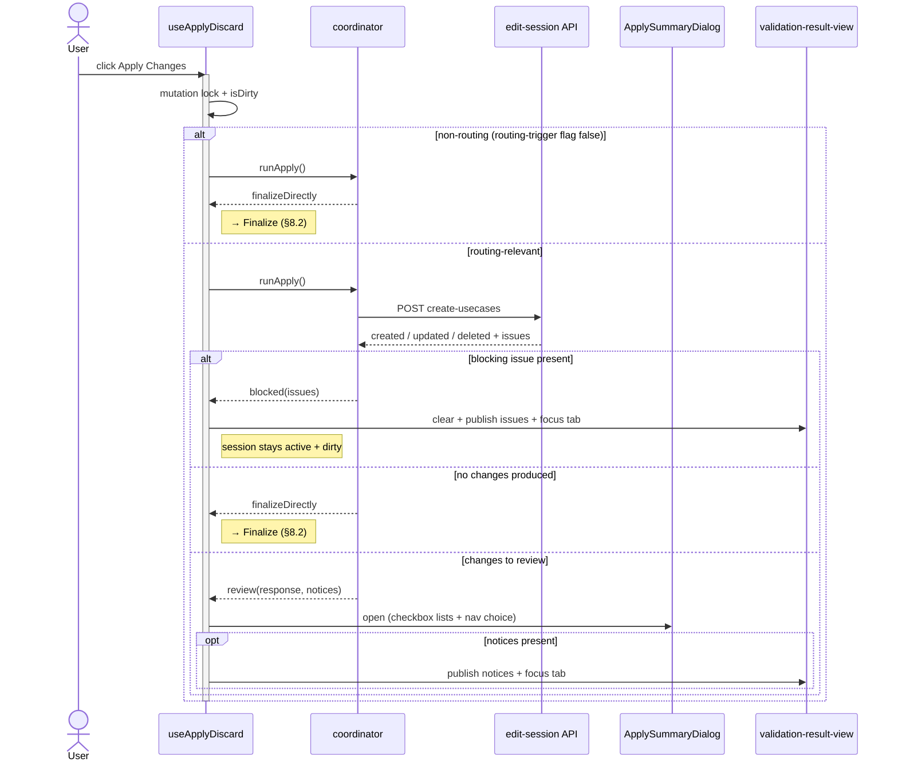

# Apply / Discard Changes — Low-Level Design

> Requirements: [requirements.md](requirements.md)
>
> Feature path: `packages/react-app/src/features/graph-designer/`
> New entity client: `packages/react-app/src/entities/project-edit-session/`
> Backend endpoints: `create-usecases`, `stage-changes`, `commit-changes`, `discard-changes`, `end-session`

---

## Table of Contents

1. [Purpose and Scope](#1-purpose-and-scope)
2. [Domain Concepts](#2-domain-concepts)
3. [High-Level Architecture](#3-high-level-architecture)
4. [File Structure](#4-file-structure)
5. [Data Model — DTOs](#5-data-model--dtos)
6. [API Client Layer](#6-api-client-layer)
7. [State, Hooks, and the Re-entrancy Guard](#7-state-hooks-and-the-re-entrancy-guard)
8. [Control Flow](#8-control-flow)
9. [UI Placement and Components](#9-ui-placement-and-components)
10. [Issue Surfacing and Gating](#10-issue-surfacing-and-gating)
11. [QUI Component Mapping](#11-qui-component-mapping)
12. [Design Decisions and Invariants](#12-design-decisions-and-invariants)
13. [DTO Ownership](#13-dto-ownership)
14. [Resolved Questions & Deferred Confirmations](#14-resolved-questions--deferred-confirmations)

---

## 1. Purpose and Scope

This feature applies a user's in-progress graph edits — reconciling, reviewing, and
committing them (Apply) or dropping them (Discard) — and returns the project to
READONLY. Concretely, it owns everything that happens **after** the user clicks
**Apply Changes** or **Discard Changes** in the graph designer, up to and including
the return to READONLY, finalizing through the backend edit-session.

Requirements are frozen in [requirements.md](requirements.md); this document is the
low-level design that implements FR-AD-01 … FR-AD-16, the invariants (I1–I3), and the
NFRs. Every requirement ID cited below maps to that document.

**Out of scope:** starting the edit session and the edits themselves, previewing and
partial-staging changes, link-exclusion UI, subsystem-filtered summary sections, and
the tab-close-while-dirty flow. See requirements §7 for the full list.

**Starting point.** None of this exists in the frontend today. This feature builds the
entity client layer, the DTOs it owns (§13), the orchestration hook, and the UI (the
button container + dialogs). It consumes the existing graph-designer store,
validation-result-view, logger, toast, and QUI patterns unchanged, and adds one
programmatic tab-focus method to `TabLayoutService` (§10).

---

## 2. Domain Concepts

Terms shared with requirements (edit-session, routing-trigger flag, staging set,
navigation choice, READONLY) are defined in [requirements §2](requirements.md#2-definitions)
and used here as-is. The terms below are design vocabulary this document introduces:

| Concept | Meaning in this design |
|---------|------------------------|
| `changeId` | Per-usecase stageable handle returned by `create-usecases` on each created/updated/deleted row. Staging and committing key off it. |
| Reconcile | The `create-usecases` call: validates edits, returns created/updated/deleted usecases + issues. |
| Indeterminate failure | A transport failure on a mutating finalize call (no response received), so the backend outcome cannot be determined by the frontend (FR-AD-10, A6). Backend business errors (for example `stage-changes` failure/partial, `commit-changes` `400`/`422`, `discard-changes` failure, `end-session` `422`/`400`) are *determinate* — the session stays active. |

---

## 3. High-Level Architecture

Three layers, bottom-up (FSD: `entities` → `features` → UI within the feature):

```
┌─────────────────────────────────────────────────────────────┐
│ UI (features/graph-designer/ui)                               │
│   ApplyDiscardControls      ← button container (see §9)        │
│   ApplySummaryDialog        ← checkbox lists + nav radio       │
│   DiscardConfirmDialog      ← QUI danger dialog                │
└───────────────▲───────────────────────────────────────────────┘
                │ calls
┌───────────────┴───────────────────────────────────────────────┐
│ Orchestration (features/graph-designer/model + hooks)          │
│   useApplyDiscard()         ← mutation lock, branch, toast, log│
│   apply-discard-coordinator ← pure pipeline sequencing         │
└───────────────▲───────────────────────────────────────────────┘
                │ calls
┌───────────────┴───────────────────────────────────────────────┐
│ Entity client (entities/project-edit-session)                  │
│   createUsecases / stageChanges / commitChanges /              │
│   discardChanges / endSession   + DTOs                         │
└───────────────▲───────────────────────────────────────────────┘
                │ uses
   shared/api httpClient • shared/lib/logger • global-toaster •
   validation-result-view slice + TabLayoutService focus (§10)
```

The orchestration hook is the only place that touches the graph-designer store
(`loadGraphData`, `isDirty`, `markClean`), the validation-result slice, the
tab-focus service, and the re-entrancy guard. The coordinator is a pure async function
(no React, no store) that sequences the backend calls and returns a typed outcome; the
hook interprets that outcome into store mutations, issue publication, toasts, and logs.
This keeps the sequencing testable without React.

---

## 4. File Structure

**New — entity client (`packages/react-app/src/entities/project-edit-session/`):**

| File | Responsibility |
|------|----------------|
| `model/create-usecases.dto.ts` | `CreateUsecasesRequestDto`, `CreateUsecasesResponseDto`, `UsecaseIdentifierWithChangeInfoDto` |
| `model/stage-changes.dto.ts` | `StageChangesRequestDto`, `StageChangesResponseDto` |
| `model/commit-changes.dto.ts` | `CommitChangesRequestDto`, `CommitChangesResponseDto` |
| `model/discard-changes.dto.ts` | `DiscardChangesRequestDto`, `DiscardChangesResponseDto` |
| `model/session.dto.ts` | `SessionResponseDto`, `SessionMode` |
| `api/project-edit-session-api.ts` | `createUsecases`, `stageChanges`, `commitChanges`, `discardChanges`, `endSession` |
| `index.ts` | Public API — the five fns + DTO types |

**New — shared issue entity (`packages/react-app/src/entities/api-issues/`):**

| File | Responsibility |
|------|----------------|
| `model/api-issue.dto.ts` | `ApiIssueItem`, `IssueSeverity`, `IssueCategory`, `ApiImpactedEntityDto`, `IssueEntityType`, `ApiFixOptionDto`, `ApiClientInputSpecDto`, `ClientInputType` |
| `index.ts` | Public API — the issue DTO types |

**New — feature orchestration & UI (`packages/react-app/src/features/graph-designer/`):**

| File | Responsibility |
|------|----------------|
| `hooks/use-apply-discard.ts` | Orchestration hook: mutation lock, store wiring, issue publication, toast, logging |
| `model/apply-discard-coordinator.ts` | Pure pipeline: sequences the backend calls, returns a typed `ApplyOutcome` / `DiscardOutcome` |
| `model/apply-discard.types.ts` | `ApplyOutcome`, `DiscardOutcome`, `NavigationChoice`, `SummaryRow` types |
| `lib/build-create-usecases-request.ts` | Assembles `CreateUsecasesRequestDto` from store seams (A2/A3) |
| `lib/build-navigation-usecases.ts` | Maps navigation choice + created rows → next `selectedUsecases` for reload (FR-AD-06/15) |
| `lib/issue-gate.ts` | `isBlockingIssue(issue)` / `partitionIssues(...)` (FR-AD-04, §10) |
| `lib/map-issue-to-validation-result.ts` | Maps `ApiIssueItem` → `ValidationResult` for the validation-result-view (§10) |
| `ui/apply-discard-controls.tsx` | Button container placed next to the usecase-selection control: `Apply` + `Discard` (§9) |
| `ui/apply-summary-dialog.tsx` | Summary dialog: checkbox lists + navigation radio group |
| `ui/discard-confirm-dialog.tsx` | Danger confirm dialog |

The Apply/Discard triggers live in **`ApplyDiscardControls`**, a small button
container rendered next to the `UsecaseSelectionControl` (§9) — plain adjacent QUI
`Button`s, not a `ButtonGroup` and not a side-nav item.

**Modified — layout (`packages/react-app/src/widgets/project-layout/project-layout-manager.tsx`):**

| File | Change |
|------|--------|
| `project-layout-manager.tsx` | Add a public `focusTab(nodeId)` method to `TabLayoutService` that dispatches `Actions.selectTab(nodeId)`, so the feature can bring the validation-result-view tab into focus after errors surface (§10). |

**Consumed unchanged:** `shared/api` (`httpClient`, `ApiResult`), `shared/lib/logger`,
`shared/controls/global-toaster` (`showToast`), the graph-designer store
(`loadGraphData`, `isDirty`, `markClean`, `selectedUsecases`), the
`ValidationResultSlice` (`addValidationResult`, `clearValidationResults`,
`ValidationResult`, `SeverityType`), the `UsecaseSelectionControl` host container,
QUI subpath imports.

**Consumed from the edit-session slice (defined on base; composed into the store by
this feature):** `kvSelectionsById`, `excludedLinks`, `mode`, `isMutating`,
`withMutationLock`, `exitEditMode`. Its population is out-of-scope edit-mode state
(A2/A3).

---

## 5. Data Model — DTOs

All field names/types below match the backend API contract. Types
this feature **owns** (§13) are declared here; `KeyValueInfo` / `RelatedEndPointLink` come
from the usecase entity, `ApiIssueItem` from the shared `api-issues` entity, and
`SubgraphKvSelectionDto` is owned here (§13).

### 5.1 `create-usecases`

```ts
// model/create-usecases.dto.ts
import type {ApiIssueItem} from '~entities/api-issues';
import type {KeyValueInfo, RelatedEndPointLink} from '~entities/usecases';

export interface SubgraphKvSelectionDto {
  systemId: string;
  valueSystemIds: string[][];
}

export interface CreateUsecasesRequestDto {
  selectedUsecaseSystemIds: string[];
  activeSubgraphs: SubgraphKvSelectionDto[];
  excludedControlLinkSystemIds?: string[];
  excludedDataLinkSystemIds?: string[];
}

export interface UsecaseIdentifierWithChangeInfoDto {
  changeId: string;
  keyValueCollection: KeyValueInfo[];
  systemId: string;
  usecaseType: 'Ec' | 'Manual' | 'Regular';
  relatedEndPointLinks?: RelatedEndPointLink[];
  usecaseAliasId?: number;
  usecaseAliasName?: string;
  usecaseCategory?: string;
}

export interface CreateUsecasesResponseDto {
  created: UsecaseIdentifierWithChangeInfoDto[];
  deleted: UsecaseIdentifierWithChangeInfoDto[];
  issues: ApiIssueItem[];
  updated: UsecaseIdentifierWithChangeInfoDto[];
}
```

`SubgraphKvSelectionDto` is **owned here** — the edit-session slice exposes selection
*state* (`kvSelectionsById`), and this feature owns the *wire shape* create-usecases
accepts. `ApiIssueItem` is imported from the shared `~entities/api-issues` entity (D-O3),
and `KeyValueInfo` / `RelatedEndPointLink` from the usecase entity — neither is redefined here.
`UsecaseIdentifierWithChangeInfoDto` is declared **standalone** (not `extends` the
existing dead `UsecaseIdentifierDto`) to avoid coupling to unused code (D4). Its
`changeId` is the required stageable handle.

The request is built by `buildCreateUsecasesRequest`, which adapts edit-session state to
the wire shape:

- `activeSubgraphs` — for each `[subgraphId, selections]` in `kvSelectionsById`,
  `{systemId: subgraphId, valueSystemIds: selections.filter(s => s.selected)
  .map(s => s.keyValuePairs.map(kv => kv.valueInfo.valueSystemId))}`.
- `excludedDataLinkSystemIds` / `excludedControlLinkSystemIds` — `excludedLinks`
  partitioned on `connectionType`, each mapped to `connectionId` (the backend link
  system-id).

The `create-usecases` issue array lives inside the response payload; an
"empty arrays with success: true" reconciliation (FR-AD-08) is read as: response `data`
present and `created`/`updated`/`deleted` all empty.

### 5.2 `stage-changes`

```ts
// model/stage-changes.dto.ts
export interface StageChangesRequestDto {
  changeIds: string[];
}

export interface StageChangesResponseDto {
  failedChangeIds: string[];
  message: string;
  processedChangeIds: string[];
  success: boolean;
}
```

### 5.3 `commit-changes`

The dedicated committer, available in all session modes. Omitting `changeIds`
commits **all staged** changes — this feature always commits the whole staged set in
one sweep, never a subset. We call it with **`?enforceValidation=true`** so the backend
runs its commit-group validation rules before applying; validation failures return
`422` and are surfaced (§10). `400` signals invalid input or missing dependencies.
`failedChangeIds` / `missingDependencies` report which changes did not commit; a
non-empty `failedChangeIds` (or `success: false`) is treated as a reportable finalize
failure that leaves those changes staged (§8.2).

The swagger contract treats `changeIds` **not provided *or* empty** as "commit all
staged." This feature expresses "all" solely by **omission** (the coordinator calls
`commitChanges(projectId, undefined, true)`); it never intentionally sends `[]`.
`httpClient` serializes bodies with `JSON.stringify`, which **drops** `undefined`-valued
properties (`shared/api/http-client.ts`), so `{changeIds: undefined}` goes on the wire as
`{}` — genuine omission, not a `changeIds` key set to null. The frontend invariant
("`undefined` for all, never `[]`") is held regardless of the backend's empty-array
handling, so a later backend change that rejects `[]` cannot break this feature.

```ts
// model/commit-changes.dto.ts
export interface CommitChangesRequestDto {
  changeIds?: string[];
}

export interface CommitChangesResponseDto {
  failedChangeIds: string[];
  message: string;
  missingDependencies?: string[];
  processedChangeIds: string[];
  success: boolean;
}
```

### 5.4 `discard-changes`

Omitting `changeIds` discards everything uncommitted and cascades (A1, FR-AD-14). As
with `commit-changes` (§5.3), the swagger treats not-provided *or* empty as "discard
all"; this feature always expresses "all" by **omission** (`discardChanges(projectId)`,
no ids) and never sends `[]`, so the behaviour is unambiguous and robust to a future
backend that rejects empty arrays.

```ts
// model/discard-changes.dto.ts
export interface DiscardChangesRequestDto {
  changeIds?: string[];
}

export interface DiscardChangesResponseDto {
  cascadedChangeIds: string[];
  failedChangeIds: string[];
  message: string;
  processedChangeIds: string[];
  success: boolean;
}
```

### 5.5 `end-session`

`end-session` takes **no request body** and returns a `SessionResponseDto` whose
`sessionMode` confirms `READONLY`. It is a plain session transitioner: it
discards all **unstaged** changes, but **refuses to run while staged changes remain**,
returning `422 STAGED_CHANGES_EXIST` (with `details.stagedCount`). Its `400` means
purely "no active session." On a *business* error the backend leaves the session active,
so both codes are determinate finalize failures (§8.2).

The finalize order guarantees the staged set is already drained by a *fully successful*
`commit-changes` before this call, so a determinate `422 STAGED_CHANGES_EXIST` here can
only follow a **partial** commit (which we already stop on) — never the normal path. The
case the normal path can still hit is a **transport failure** on this `end-session` after
the commit already succeeded: the commit is durable, but the READONLY transition is
unconfirmed. Recovery is a **retry of `end-session`**, but the retry is *not guaranteed*
to return READONLY — the original call may already have ended the session, in which case
the retry returns `400 no active session`. So the coordinator treats the retry as:
`200` + `READONLY` → finish normally; `400 no active session` (or any other contradictory
determinate state) → the committed work may already be ended, so **reload/reconcile**
rather than assuming the session is still active and dirty. It never reads a
post-commit retry `400` as proof the session survived.

```ts
// model/session.dto.ts
export type SessionMode =
  | 'DESIGNER' | 'DIFF_MERGE' | 'DISCOVERY_WIZARD' | 'READONLY' | 'TUNING';

export interface SessionResponseDto {
  projectId: string;
  sessionMode: SessionMode;
  summary: string;
}
```

`SessionResponseDto.summary` (a human-readable account of what was committed/cleared)
is a required field; this feature consumes `sessionMode` (to confirm READONLY)
and `projectId`, and may log `summary`.

---

## 6. API Client Layer

Mirrors the existing convention (`entities/usecases/api/usecases-api.ts`): thin
functions over the shared `httpClient`, returning `ApiResult<T>`.

```ts
// entities/project-edit-session/api/project-edit-session-api.ts
import {type ApiResult, httpClient} from '~shared/api';
import type {CommitChangesRequestDto, CommitChangesResponseDto} from '../model/commit-changes.dto';
import type {CreateUsecasesRequestDto, CreateUsecasesResponseDto} from '../model/create-usecases.dto';
import type {DiscardChangesRequestDto, DiscardChangesResponseDto} from '../model/discard-changes.dto';
import type {SessionResponseDto} from '../model/session.dto';
import type {StageChangesRequestDto, StageChangesResponseDto} from '../model/stage-changes.dto';

export async function createUsecases(
  projectId: string,
  body: CreateUsecasesRequestDto,
): Promise<ApiResult<CreateUsecasesResponseDto>> {
  return httpClient.post<CreateUsecasesResponseDto>(
    `/projects/${projectId}/create-usecases`,
    body,
  );
}

export async function stageChanges(
  projectId: string,
  changeIds: string[],
): Promise<ApiResult<StageChangesResponseDto>> {
  return httpClient.post<StageChangesResponseDto>(
    `/projects/${projectId}/stage-changes`,
    {changeIds} satisfies StageChangesRequestDto,
  );
}

export async function commitChanges(
  projectId: string,
  changeIds?: string[],
  enforceValidation = false,
): Promise<ApiResult<CommitChangesResponseDto>> {
  const query = enforceValidation ? '?enforceValidation=true' : '';
  return httpClient.post<CommitChangesResponseDto>(
    `/projects/${projectId}/commit-changes${query}`,
    {changeIds} satisfies CommitChangesRequestDto,
  );
}

export async function discardChanges(
  projectId: string,
  changeIds?: string[],
): Promise<ApiResult<DiscardChangesResponseDto>> {
  return httpClient.post<DiscardChangesResponseDto>(
    `/projects/${projectId}/discard-changes`,
    {changeIds} satisfies DiscardChangesRequestDto,
  );
}

export async function endSession(
  projectId: string,
): Promise<ApiResult<SessionResponseDto>> {
  return httpClient.post<SessionResponseDto>(`/projects/${projectId}/end-session`);
}
```

`ApiResult<T>` (`~shared/api`, `{data?, success, message, errors?, warnings?}`)
distinguishes transport/HTTP failures (`success === false`, `data` absent) from a
well-formed payload; the `create-usecases` issue array lives inside the response
`data`, not on the envelope.

`commitChanges` exposes `enforceValidation` as an optional argument (the endpoint
supports both); the coordinator always passes `true` so the backend runs its
commit-group validation rules — that is what turns "modules added but attached to no
committed usecase" into a surfaced `422` rather than a silent partial commit (§8.2).

For "commit all / discard all", the coordinator passes `changeIds` as `undefined` (never
`[]`, §5.3/§5.4). The `{changeIds} satisfies …RequestDto` skeleton relies on
`JSON.stringify` dropping the `undefined` property so the wire body is `{}` — this is
intentional and matches the codebase idiom, and the implementation plan pins it with a
test asserting the serialized body carries **no** `changeIds` key when the argument is
omitted. `stageChanges` always receives a concrete `string[]` (never omitted).

---

## 7. State, Hooks, and the Re-entrancy Guard

### 7.1 Store consumption

The hook reads/writes the per-project graph-designer store via
`useGraphDesignerStore()` (imperative `getState`) and subscribes to slices via
`useGraphDesignerStoreShallow(selector)`:

- `isDirty: boolean` — gates the **Apply** button (disabled when `!isDirty`, FR-AD-01) and whether Discard prompts for confirmation (FR-AD-13). Discard itself stays enabled whenever a session is active (FR-AD-12).
- `selectedUsecases: string[]` — current selection; input to reconcile + navigation.
- `loadGraphData(usecases: string[], options?: {stagingSessionId?: string}): Promise<void>` — post-op reload (FR-AD-15).
- `markClean(): void` — cleared only on confirmed success (never on FR-AD-10).
- `kvSelectionsById` / `excludedLinks` — edit-session state adapted into the
  create-usecases request (§5.1, A2/A3).
- `withMutationLock(getState, action)` / `exitEditMode()` — the serial mutation guard
  (§7.2) and the lock release run on a confirmed READONLY transition (§8.2, D3).

This feature composes `createEditSessionSlice(set, projectId)` into the
`GraphDesignerStore` union and factory (`graph-designer-store.ts`); the slice ships
defined but unwired, and this is its first consumer.

Issue publication uses the `ValidationResultSlice`: `clearValidationResults()` then
`addValidationResult(result)` per mapped issue (§10).

### 7.2 Re-entrancy guard (NFR-AD-01, I3)

Serialization uses the edit-session slice's `withMutationLock(getState, action)`: it
throws if `mode !== 'edit'` or a mutation is already in flight (`isMutating`), otherwise
runs `action` under `beginMutation` / `endMutation` with a `finally` release. This is a
**store-level** guard shared across all edit mutations — stronger than a hook-local
`useRef`, since a stray concurrent edit cannot slip past it. Re-entry **throws** (rather
than silently returning), and the hook's `catch` turns that into a logged no-op. `isBusy`
remains a hook-local flag purely to disable the buttons during flight; the lock is the
correctness guarantee.

```ts
// hooks/use-apply-discard.ts (skeleton)
const [isBusy, setIsBusy] = useState(false);

const apply = useCallback(async () => {
  const store = getState();
  if (!store.isDirty) return;
  setIsBusy(true);
  try {
    const outcome = await withMutationLock(getState, () => runApply(/* deps */));
    await handleApplyOutcome(outcome);
  } catch (err) {
    logger.error('Apply failed', {action: 'apply_changes', component: 'useApplyDiscard', error: String(err)});
    showToast('Apply failed', 'danger');
  } finally {
    setIsBusy(false);
  }
}, [/* deps */]);
```

`discard` follows the same skeleton **without** the `isDirty` early-return — it is
callable whenever a session is active (FR-AD-12); when `isDirty` is true it first
opens `DiscardConfirmDialog`, and when clean it proceeds straight to finalize
(FR-AD-13). `isBusy` disables both buttons during an in-flight operation;
`withMutationLock` is the correctness guarantee.

### 7.3 Logging & toast vs. issue view (NFR-AD-02)

Two distinct surfaces, by intent:

- **Toast** — terminal *operation* status only (success, aborted, uncertain outcome).
  Short and transient.
- **validation-result-view** — backend-reported *issues* (blocking issues, notices,
  reportable finalize errors). Actionable, persistent, filterable (§10).

Every backend call and terminal outcome logs via
`logger.info|error(msg, {action, component: 'useApplyDiscard', ...})`. Actions:
`apply_changes`, `discard_changes`, `create_usecases`, `stage_changes`,
`commit_changes`, `end_session`, plus terminal `*_success` / `*_aborted` / `*_error`.

---

## 8. Control Flow

The coordinator is a pure function returning a discriminated-union outcome; the hook
maps outcomes to effects. This separates sequencing (testable) from React effects.
Requirement traceability is kept in the [mapping table](#84-requirement-mapping)
rather than inline on each step.

### 8.1 Apply — reconcile and branch



### 8.2 Finalize — stage → commit → end-session

The finalize sequence is shared by every path that ends a session on Apply (routing
review OK, non-routing branch, empty reconciliation): stage the checked usecases (if
any), commit **all staged** changes with validation enforced, then end the session.
The order is load-bearing — `commit-changes` drains the staged set so `end-session`
never hits `422 STAGED_CHANGES_EXIST` on the normal path.

```mermaid
sequenceDiagram
    participant Dialog as ApplySummaryDialog
    participant Hook as useApplyDiscard
    participant Api as edit-session API
    participant Store as graph-designer store
    participant VView as validation-result-view

    Dialog->>Hook: onOK(checkedChangeIds, navChoice)
    activate Hook
    alt checkedChangeIds non-empty and stage fails/partial
        Hook->>Api: POST stage-changes(notYetStagedIds)
        Api-->>Hook: error / failedChangeIds
        Hook->>VView: publish reportable error + focus tab
        Note right of Hook: stay active + dirty; return, do NOT commit
    else stage ok (empty selection, or success with no failedChangeIds)
        opt checkedChangeIds non-empty
            Hook->>Api: POST stage-changes(notYetStagedIds)
        end
        Hook->>Api: POST commit-changes?enforceValidation=true (no ids → all staged)
        alt commit ok (success, no failedChangeIds)
            Hook->>Api: POST end-session
            alt end-session ok (sessionMode READONLY)
                Api-->>Hook: SessionResponseDto
                Hook->>Store: loadGraphData(nav) + markClean + exitEditMode
                Note right of Hook: success toast
            else end-session 422 or 400 (determinate)
                Api-->>Hook: error
                Hook->>VView: publish reportable error + focus tab
                Note right of Hook: stay active, markClean NOT called
            else end-session transport failure (commit already durable)
                Api-->>Hook: no response
                Note right of Hook: retry end-session — READONLY→finish; 400/contradiction→reload
            end
        else commit 400 / 422 / partial (failedChangeIds)
            Api-->>Hook: error
            Hook->>VView: publish reportable error + focus tab
            Note right of Hook: rejected → all staged; partial → processed durable, rest staged; session active
        end
    end
    deactivate Hook
    Note over Dialog,Hook: onCancel → return, no backend calls
    Note over Hook,Api: transport failure on any call → indeterminate (FR-AD-10)
```

`onOK` **always** proceeds to finalize, even with zero checked usecases — it stages
nothing but still attempts `commit-changes` + `end-session`; it is never collapsed into
a no-op or into Cancel. With no usecases checked the backend may reject the commit
(e.g. modules added but attached to no committed usecase, caught by
`enforceValidation`); that is a reportable failure surfaced in the validation view, and
the session stays active so the user can remove the orphan modules or reopen Apply and
check a usecase (FR-AD-07).

**Failure classification.** Each finalize call resolves to one of:

- **Determinate business error** — `stage-changes` HTTP/business failure, `success: false`,
  or non-empty `failedChangeIds`; `commit-changes` `400` (invalid input / missing
  dependencies), `commit-changes` `422` (validation), a commit that returns
  `success: true` but a non-empty `failedChangeIds` (partial commit); or `end-session`
  `422 STAGED_CHANGES_EXIST` / `400 no active session`. The backend leaves the session
  active; the frontend publishes the error to the validation view, keeps the session
  dirty, and does **not** call `markClean`. A `stage-changes` failure additionally
  **short-circuits before `commit-changes`** — an incomplete staged set is never
  committed. The user retries or discards (FR-AD-09, I1).
- **Indeterminate failure** — a transport failure on any mutating call (no response
  received). Backend state is unknown; the frontend asserts nothing, keeps the session
  dirty, and shows a toast advising a reload to observe actual state (FR-AD-10, D2). The
  one refinement is `end-session` after a *successful* commit (§5.5): the commit is
  durable, so the retry may return `400 no active session` if the original already ended
  the session — the frontend reloads/reconciles rather than asserting the session is
  still active.

A partial commit (`success: true` with non-empty `failedChangeIds`) is deliberately
treated as a stop, and it is **not** "graph unmodified": the `processedChangeIds` are
already durably committed while the `failedChangeIds` remain staged. The still-staged set
would make a subsequent `end-session` `422`, so the frontend does not chain into
`end-session` — it surfaces the reported split, keeps the session active, and does not
call `markClean`; the user retries the remainder, discards, or reloads to reconcile
(I1 partial-commit, I2 preserved — each change is committed xor staged, never both).

**Stage-retry set.** A partial `stage-changes` leaves the ids in its `processedChangeIds`
staged. The coordinator does **not** assume the backend treats re-staging an
already-staged id as a no-op (the `stage-changes` swagger does not document idempotency),
so on retry it re-stages only the *not-yet-staged* selected ids —
`checkedChangeIds − processedChangeIds` — rather than blindly re-sending the full checked
set. If the backend later confirms staging an already-staged id is a success/no-op, this
can be simplified to re-sending the whole set; until then the coordinator tracks
`processedChangeIds` so retry is unambiguous. (Backend assumption, flagged in
requirements §6.)

### 8.3 Discard

```mermaid
sequenceDiagram
    actor User
    participant Hook as useApplyDiscard
    participant Confirm as DiscardConfirmDialog
    participant Api as edit-session API
    participant Store as graph-designer store
    participant VView as validation-result-view

    User->>Hook: click Discard Changes
    activate Hook
    Hook->>Hook: mutation lock (no isDirty gate)
    alt session dirty
        Hook->>Confirm: open (danger)
        Confirm-->>Hook: confirmed
    else session clean
        Note right of Hook: skip confirm (nothing to lose)
    end
    Hook->>Api: POST discard-changes (no changeIds → all + cascade)
    Hook->>Api: POST end-session
    alt ok (sessionMode READONLY)
        Api-->>Hook: SessionResponseDto
        Hook->>Store: loadGraphData(keep) + markClean + exitEditMode
        Note right of Hook: success toast
    else determinate business error (422 / 400 / success false)
        Api-->>Hook: error
        Hook->>VView: publish reportable error + focus tab
        Note right of Hook: stay active + dirty; toast = terminal status
    else transport failure
        Api-->>Hook: no response
        Note right of Hook: indeterminate (FR-AD-10) — reload to reconcile
    end
    deactivate Hook
    Note over User,Hook: cancel at confirm → return, no backend calls
```

Discard-all clears everything uncommitted — staged and unstaged, with cascade — so the
subsequent `end-session` sees nothing staged and returns to READONLY without a `422`
(ordering is load-bearing — A1). Navigation choice is always `keep` on discard (no
created rows). Finalize failures classify exactly as in §8.2 and surface the same way:
a determinate `discard-changes` / `end-session` business error is a reportable error
published to the validation-result-view with the tab focused (FR-AD-16), not a toast-only
message; the toast is reserved for terminal status. A transport failure is indeterminate
(FR-AD-10).

### 8.4 Requirement mapping

| Step / branch | Requirements |
|---------------|--------------|
| Apply gated on `isDirty` + guard | FR-AD-01, NFR-AD-01, I3 |
| Non-routing → commit all staged + end-session | FR-AD-02 |
| create-usecases reconcile | FR-AD-03 |
| Blocking issue → abort, publish, stay dirty | FR-AD-04, I1, §10 |
| Empty reconciliation → finalize (commit + end) | FR-AD-08 |
| Review dialog (lists + nav choice) | FR-AD-05, FR-AD-06 |
| onOK stages checked + commits + ends; onOK-none still attempts; onCancel returns | FR-AD-07 |
| Finalize failure handling (determinate vs transport-indeterminate) | FR-AD-09, FR-AD-10, FR-AD-11, I1 |
| Post-success reload + markClean + nav | FR-AD-15 |
| Discard callable whenever session active + guard | FR-AD-12, NFR-AD-01 |
| Discard danger confirm only when dirty; clean discard skips it | FR-AD-13 |
| Discard drops all + ends session | FR-AD-14 |

---

## 9. UI Placement and Components

### 9.1 Placement — button container next to the usecase-selection control

Starting and ending an edit session are routine, prominent operations, so the
triggers live in the main content area, not the side-nav icon rail. A small
`ApplyDiscardControls` container sits **next to the `UsecaseSelectionControl`** in the
graph designer's top bar (the existing `flex-shrink-0 p-4` row that hosts the usecase
pickers). The buttons follow a **swap** model:

- **`Modify`** — starts the edit session. **Out of scope** for this feature (owned by
  the edit-mode / start-session work); shown here only for context. While READONLY,
  `Modify` is visible.
- On `Modify`, out-of-scope code swaps it for **`Apply`** + **`Discard`** for the
  duration of the session; on return to READONLY it swaps back to `Modify`. This
  feature **assumes `Apply`/`Discard` are mounted and active** and owns only their
  behaviour and enabled/disabled state.

```
┌─ Graph Designer widget ───────────────────────────────────────────────┐
│ ┌─ top bar (flex-shrink-0 p-4) ───────────────────────────────────────┐│
│ │  [ UsecaseSelectionControl:  usecase pickers … ]   ┌─ApplyDiscard─┐  ││
│ │                                                    │ ✎ Modify     │  ││  READONLY
│ │                                                    └──────────────┘  ││
│ │                                              — or, while session — ── ││
│ │                                                    ┌─ApplyDiscard─┐  ││
│ │                                                    │ ✓ Apply      │  ││  session
│ │                                                    │ 🗑 Discard    │  ││  active
│ │                                                    └──────────────┘  ││
│ └─────────────────────────────────────────────────────────────────────┘│
│   ┌─ graph canvas (UsecaseVisualizer) ──────────────────────────────┐   │
│   │                                        [ search overlay ▸ ]      │   │
│   └─────────────────────────────────────────────────────────────────┘   │
├─ bottom panel tabs ─────────────────────────────────────────────────────┤
│  [ Log View ]  [ Validation Results ]  ← focused when issues surface     │
└──────────────────────────────────────────────────────────────────────────┘
```

**Button scheme** (QUI `Button`, `variant="fill"`, `lucide-react` icons, text labels
kept):

| Button | `emphasis` | Icon | Enabled when | Owner |
|--------|-----------|------|--------------|-------|
| `Modify` | `neutral` | `Pencil` | READONLY | external seam (edit-mode dev) |
| `Apply` | `primary` | `Check` | session active **and** `isDirty` **and** `!isBusy` | this feature |
| `Discard` | `danger` | `Trash2` | session active **and** `!isBusy` | this feature |

The asymmetry is deliberate (requirements dead-end fix): `Apply` gates on `isDirty`
(nothing to apply when clean), but `Discard` must stay enabled whenever a session is
active, because `Apply`/`Discard` are the *only* controls visible during a session —
gating both on `isDirty` would trap the user in a clean session with no way back to
READONLY. `isBusy` (the §7.2 guard) disables both during an in-flight operation.

`ApplyDiscardControls` renders plain adjacent `Button`s (no `ButtonGroup`), reads
`isDirty` / `isBusy` from the hook, and calls `useApplyDiscard().apply` / `.discard`.

### 9.2 `ApplySummaryDialog` (`ui/apply-summary-dialog.tsx`)

Driven by `CreateUsecasesResponseDto`. Renders one section per **non-empty** category
(Created / Updated / Deleted); a section with no rows is omitted (FR-AD-05). Each row
is a `Checkbox` (checked by default) labelled with the usecase display name, keyed by
`changeId`. The section list is data-driven from the response keys, so future
categories render without structural change (requirements §7 boundary).

When `created.length > 0`, renders the navigation `RadioGroup` (FR-AD-06): options
`keep` (default) / `add` / `switch`, each with a one-line helper. Hidden when there
are no created rows.

Footer: **OK** (collects checked `changeId`s + nav choice → `onOK`) and **Cancel**
(→ `onCancel`). Local component state holds the checkbox selection and nav choice;
nothing is committed until OK.

### 9.3 `DiscardConfirmDialog` (`ui/discard-confirm-dialog.tsx`)

`Dialog.Root emphasis="danger"` (FR-AD-13). Confirm resolves the discard promise;
close/cancel aborts. No state beyond open/closed.

---

## 10. Issue Surfacing and Gating

### 10.1 Where issues go

Every backend-reported problem in the pipeline is surfaced in the
**validation-result-view**, not in a toast (FR-AD-11, FR-AD-16): `create-usecases`
issues (blocking issues that abort Apply, and non-blocking / data-loss notices) **and**
reportable business errors from any finalize call — Apply's `stage-changes` /
`commit-changes` / `end-session` and Discard's `discard-changes` / `end-session`. The hook:

1. `clearValidationResults()` — drop stale results from a prior attempt.
2. `addValidationResult(mapIssueToValidationResult(issue))` for each issue.
3. **Focus the validation-result tab** via `tabLayoutService.focusTab(nodeId)` so the
   user is taken straight to the actionable list.

The validation-result-view is **assumed already mounted** in the project layout (a
sibling tab next to the Log View, out of scope to wire here — §14 O5). The in-scope
obligations are: populate the list (steps 1–2) and bring the tab into focus (step 3).
Bringing focus requires a small addition to `TabLayoutService` — a public
`focusTab(nodeId)` that dispatches `Actions.selectTab(nodeId)` (no such programmatic
select-tab method exists today). Any richer visual treatment (auto-expand, flash) is
an enhancement, not required.

A toast still fires for the terminal operation status (e.g. "Apply blocked — see
validation results"), pointing the user at the view.

### 10.2 `ApiIssueItem` → `ValidationResult` mapping

The validation slice's `ValidationResult` uses `SeverityType`
(`critical`/`error`/`warning`/`info`), while `ApiIssueItem` uses `IssueSeverity`
(`FATAL`/`ERROR`/`WARNING`). `lib/map-issue-to-validation-result.ts`:

| `ApiIssueItem` | `ValidationResult` |
|----------------|--------------------|
| `severity: FATAL` | `severity: 'critical'` |
| `severity: ERROR` | `severity: 'error'` |
| `severity: WARNING` | `severity: 'warning'` |
| `message` | `message` |
| `code` | `errorCode` |
| `impactedEntity` (module / subgraph / connection) | `moduleInstanceId` / `subgraphId` / `connectionId` (whichever applies) |
| `fixOptions` present | `canShowControls: true` (+ `canAutoFix` when a fix is automatic) |

`category` (BLOCKING / NON_BLOCKING / DATA_LOSS) does not map to a `ValidationResult`
field; it drives the §10.3 gate, not the row rendering.

`ApiImpactedEntityDto.systemId` is typed `number` (faithful to swagger), while the
`ValidationResult` target ids (`moduleInstanceId` / `subgraphId` / `connectionId`) are
**string** ids in graph-designer state. The mapper therefore `String(systemId)`-casts and
selects the target field by `entityType` — `SpfModule` → `moduleInstanceId`, `Subgraph`
→ `subgraphId`, `DataLink` / `ControlLink` → `connectionId`. The numeric→string cast is
expected, not a type mismatch. The implementation plan carries a mapper test covering
each `entityType` branch and the cast.

### 10.3 Gating (FR-AD-04, A7)

`create-usecases` issues carry a **required** `severity` and an **optional**
`category`. Gating on `category` alone would let a FATAL operational issue with no
category pass as benign, so the gate considers both:

```ts
// lib/issue-gate.ts
export function isBlockingIssue(issue: ApiIssueItem): boolean {
  return issue.category === 'BLOCKING'
    || issue.severity === 'FATAL'
    || issue.severity === 'ERROR';
}
```

`partitionIssues` splits into `{blocking, notices}`. Any blocking issue → abort Apply,
publish all issues to the view, stay active + dirty (I1). Notices (incl. `NON_BLOCKING`
and backend-acknowledged `DATA_LOSS`, and `WARNING` severity) are published but allow
the user to proceed; `DATA_LOSS` is a validation notice the user may ignore, distinct
from an indeterminate finalize failure. Assumption A7 records that we trust the backend
to set severity/category coherently.

---

## 11. QUI Component Mapping

All via existing subpath imports already used in the codebase (version-compatible):

| Need | QUI import | Key props (as used here) |
|------|-----------|--------------------------|
| Apply / Discard triggers | `Button` from `@qualcomm-ui/react/button` | `variant="fill"`; `emphasis="primary"` (Apply) / `"danger"` (Discard); `startIcon` (`Check` / `Trash2`); `disabled`; `onClick` |
| Summary + confirm dialogs | `Dialog` from `@qualcomm-ui/react/dialog` | `Dialog.Root` (`emphasis="danger"` for discard), `Dialog.Body`, `Dialog.Heading`, `Dialog.Footer`, `Dialog.CloseTrigger` |
| Dialog action buttons | `Button` from `@qualcomm-ui/react/button` | `onClick`, `emphasis` |
| Summary row checkboxes | `Checkbox` from `@qualcomm-ui/react/checkbox` | `checked`, `onCheckedChange`, `label`, `size="sm"` |
| Navigation choice | `Radio`, `RadioGroup` from `@qualcomm-ui/react/radio` | `value`, `onValueChange`; `Radio` `value`, `label` |
| Toasts | `showToast` from `~shared/controls/global-toaster` | `showToast(message, emphasis)` |

`ApplyDiscardControls` renders the triggers as plain adjacent `Button`s (no
`ButtonGroup`). No new shared confirm-dialog wrapper is introduced (none exists today);
the discard dialog is a focused component. If a second danger-confirm consumer appears
later, extraction to `shared/` is the follow-up.

---

## 12. Design Decisions and Invariants

- **D1 — Pure coordinator + effectful hook.** Sequencing lives in a pure async
  function returning a typed outcome; the hook applies store/issue/toast/log effects.
  Makes the branch/finalize logic unit-testable without React or a live store.
- **D2 — Finalize never asserts an outcome it cannot confirm (FR-AD-10).** `markClean`
  is called only on a confirmed READONLY transition. All backend business
  errors are determinate — `stage-changes` failure/partial stops before commit, a rejected
  `commit-changes` (`400`/`422`, nothing applied) leaves all affected changes staged, a
  partial `commit-changes` durably commits its `processedChangeIds` and leaves only the
  `failedChangeIds` staged, and `end-session` `422`/`400` leave the session active — so the
  frontend can safely keep the session dirty and surface them. The only outcome it cannot
  confirm is a transport failure on a mutating call (no response), where it asserts neither
  rollback nor success and defers to a user-driven reload. One sub-case sharpens this: a
  transport failure on `end-session` *after* a successful `commit-changes` (§5.5) — the
  commit is durable, so a retry may return `400 no active session` if the original already
  ended the session; the frontend reloads/reconciles instead of reading that `400` as proof
  the session is still active. The ambiguity is thus narrowed to transport-only; there is
  no ambiguous status code to reason about.
- **D3 — `markClean` + `exitEditMode` only on confirmed READONLY.** Both are called
  solely on a successful `end-session` (`200` + `sessionMode === 'READONLY'`), which is
  reached only after `commit-changes` has already drained the staged set. `exitEditMode`
  releases the `usecase-edit` exclusive lock and flips `mode` back to `'view'`; skipping
  it on any non-terminal outcome keeps the session (and its lock) alive for retry.
  Guarantees I1/I2: no partial READONLY, commit-XOR-clear.
- **D4 — `UsecaseIdentifierWithChangeInfoDto` is standalone.** The existing frontend
  `UsecaseIdentifierDto` (nested `changeInfo`) is dead code (unused, unexported) and
  predates the current backend contract; we neither extend nor modify it. Reconciling that dead
  type is out of scope.
- **D5 — This feature owns `SubgraphKvSelectionDto` and builds it via an adapter.** The
  edit-session slice owns selection *state* (`kvSelectionsById`); this feature owns the
  create-usecases *wire shape* and maps state to it in `buildCreateUsecasesRequest` (§5.1).
  The map filters each subgraph's selections by `selected` and projects
  `keyValuePairs[].valueInfo.valueSystemId`; excluded links are partitioned by
  `connectionType` and projected to `connectionId`. Keeping the adapter here avoids the
  edit-mode slice depending on a create-usecases wire type.
- **D6 — Discard before end-session (FR-AD-14, A1).** Ordering is load-bearing:
  discard-all clears everything uncommitted (staged included, with cascade) so
  `end-session` sees nothing staged and will not `422`.
- **D7 — Issues surface in validation-result-view, terminal status in toast.**
  Actionable backend issues belong in the persistent, filterable view (FR-AD-11);
  transient operation status belongs in a toast (§7.3, §10.1).
- **D8 — Asymmetric button gating avoids a clean-session dead end.** `Apply`/`Discard`
  are the only session controls visible while a session is active (they swap in for
  `Modify`). Gating both on `isDirty` would leave a started-but-unedited session with
  no enabled exit. So `Apply` gates on `isDirty` (FR-AD-01) but `Discard` stays enabled
  whenever a session is active (FR-AD-12), with its danger confirm shown only when
  dirty (FR-AD-13). See requirements §8 "Discard gating".
- **D9 — Feature owns tab focus, not layout wiring.** The validation-result-view is
  assumed mounted (§14 O5); this feature adds only a `TabLayoutService.focusTab(nodeId)`
  method (dispatching `Actions.selectTab`) and calls it after publishing issues (§10).
  Populating the list and focusing the tab are required; mounting the panel and any
  richer reveal animation are out of scope.
- **D10 — Commit all staged with validation enforced, never a subset.** Finalize calls
  `commit-changes` with no `changeIds` (commits the whole staged set in one sweep) and
  `?enforceValidation=true`. Committing all staged is correct because raw designer edits
  are auto-staged and the checked usecases are staged just before; `enforceValidation`
  is what turns "modules added but attached to no committed usecase" into a surfaced
  `422` instead of a silent partial commit. A partial commit (`failedChangeIds`
  non-empty) is a stop, not a chain-through: the frontend does not call `end-session`
  with changes still staged (which would `422`), it surfaces the failure and holds.

**Invariants** (requirements §4): I1 No partial READONLY, I2 Commit XOR clear, I3
Single in-flight — enforced by D2/D3/D10 and the §7.2 mutation lock. I1 holds by
the backend's own guarantee (business errors leave the session active) plus the
transport-only indeterminate carve-out (D2); I2 holds because a partial commit stops the
sequence rather than chaining into `end-session` (D10).

---

## 13. DTO Ownership

Prevents duplicate DTO definitions across this feature and the edit-mode work.

**Owned by this feature** (declared in `entities/project-edit-session/model`):

| DTO | Endpoint |
|-----|----------|
| `SubgraphKvSelectionDto` | create-usecases request (`activeSubgraphs`) |
| `CreateUsecasesRequestDto` | create-usecases (request) |
| `CreateUsecasesResponseDto` | create-usecases (response) |
| `UsecaseIdentifierWithChangeInfoDto` | create-usecases response rows |
| `StageChangesRequestDto` / `StageChangesResponseDto` | stage-changes |
| `CommitChangesRequestDto` / `CommitChangesResponseDto` | commit-changes |
| `DiscardChangesRequestDto` / `DiscardChangesResponseDto` | discard-changes |
| `SessionResponseDto` / `SessionMode` | end-session (response) |

`SubgraphKvSelectionDto` is owned here: the edit-session slice owns selection *state*
(`kvSelectionsById`), this feature owns the *wire shape*. It is constructed from that
state by `buildCreateUsecasesRequest` (§5.1), not imported.

**Owned by the shared `api-issues` entity** (declared in `entities/api-issues/model`):

| DTO | Source |
|-----|--------|
| `ApiIssueItem`, `IssueSeverity`, `IssueCategory` | `CreateUsecasesResponseDto.issues` |
| `ApiImpactedEntityDto`, `IssueEntityType` | `ApiIssueItem.impactedEntity` |
| `ApiFixOptionDto`, `ApiClientInputSpecDto`, `ClientInputType` | `ApiIssueItem.fixOptions` |

The issue framework does not exist in the frontend today, and the frontend's `ApiResult`
(`shared/api/api-response.types.ts`) does **not** mirror the backend's generic issue
envelope — it exposes `errors` / `message` / `warnings` instead. The `ApiIssueItem` family
is a **generic** backend issue contract, not apply/discard-specific, so it lives in a
shared `entities/api-issues` entity from the start rather than being owned locally and
promoted later. `create-usecases` is its first consumer.

**Consumed from usecase entity — NOT redefined:** `KeyValueInfo`, `RelatedEndPointLink`
(`entities/usecases/model/usecase-component.dto.ts`).

**Consumed from validation-result-view — NOT redefined:** `ValidationResult`,
`SeverityType`, and the slice actions `addValidationResult` / `clearValidationResults`
(`shared/store/tab-store-slices/validation-result-slice.ts`), reachable via the existing
`use-validation-results` hook.

**Consumed from the edit-session slice — NOT redefined:** `kvSelectionsById`,
`excludedLinks` (`Connection[]`), `mode`, `isMutating`, `withMutationLock`,
`exitEditMode` (`features/graph-designer/model/edit-session-slice.ts`). This feature
composes the slice into the graph-designer store (§7.1); the slice's population is
out-of-scope edit-mode state (A2/A3).

---

## 14. Resolved Questions & Deferred Confirmations

These were open during design and are recorded here for traceability — the design
evolved as the edit-mode scaffolding merged and the backend contract firmed up. None
is still open; the second group names checks to make at implementation time.

**Resolved during design:**

- **O1 — `SubgraphKvSelectionDto` ownership (A2/D5).** This feature owns the
  create-usecases wire type and constructs it via `buildCreateUsecasesRequest` (§5.1)
  from the edit-session slice's `kvSelectionsById`. No cross-feature import to wait on.
- **O2 — Excluded link ids (A3).** `Connection.connectionId` is the backend
  link system-id, so `buildCreateUsecasesRequest` partitions `excludedLinks` by
  `connectionType` and projects `connectionId` directly. The slice defaults
  `excludedLinks` to `[]` (no exclusion UI in this task, §7), so the fields are empty
  until a producing feature populates them.
- **O3 — Issue framework home.** `ApiIssueItem` and friends are a generic
  backend issue contract, not apply/discard-specific, so they live in a shared
  `entities/api-issues` entity from the start; `create-usecases` is its first consumer.

**To confirm at implementation:**

- **O5 — validation-result-view mounting (assumed, out of scope, A8).** The
  `ValidationResultPanel` exists but is **not yet mounted** in the project layout.
  This design **assumes** it is wired in as a sibling tab next to the Log View before
  this feature ships; wiring it is owned elsewhere. This feature's obligation is only
  to populate the list and focus the tab via the new `TabLayoutService.focusTab`
  method (§10, D9). Confirm the panel is mounted (and its FlexLayout node id is
  discoverable) before implementation.
- **O6 — Orphan-module rejection under `enforceValidation`.**
  Confirmed: the orphan-module rejection ("modules added but attached to no committed
  usecase") fires under `?enforceValidation=true` on `commit-changes`. This is what
  surfaces the FR-AD-07 "OK with nothing checked" reportable error. Verify the exact
  error code/shape against the backend when wiring the commit call.
